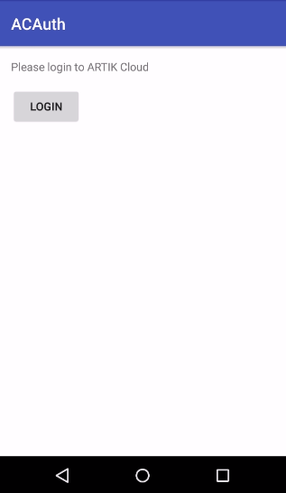
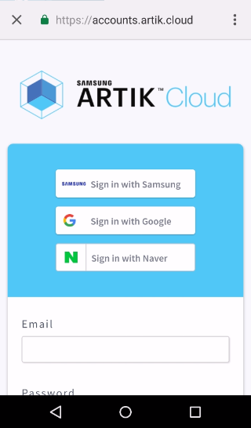
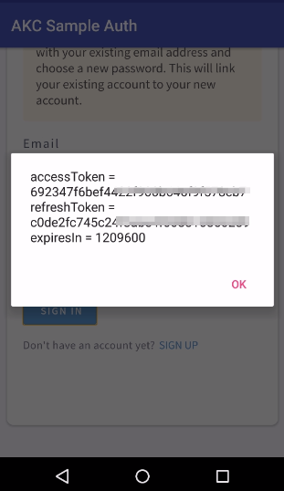

# Android OAuth Starter Code

This starter code shows how to make an OAuth call to get a [user token](https://developer.artik.cloud/documentation/introduction/authentication.html#user-token) from ARTIK Cloud. It uses [AppAuth for Android](http://openid.github.io/AppAuth-Android/)(an open source OAuth client library) instead of the WebView UI element for improved security. The implemented OAuth method is [Authorization Code method](https://developer.artik.cloud/documentation/getting-started/authentication.html#authorization-code-method).

**Stay tuned for the improved version of this sample. The newer version will implement Authorization Code + PKCE by following the best practices for native applications.**

## Demo

- Run the Android app. 
- Click Login button.

- Sign in or sign up on the following screen:

- Receive the access token after login succeeds:

## Prerequisites
* Android Studio
* Android SDK for API level 24

## Setup / Installation:

### Set up at ARTIK Cloud

Follow [these instructions](https://developer.artik.cloud/documentation/tutorials/your-first-application.html#create-an-application) to create an application using the Developer Dashboard. For this tutorial, select the following:

- Set "Redirect URL" for your application to `cloud.artik.example.oauth://oauth2callback`.
- Choose "Client Credentials, auth code".

[Make a note of your client ID and client secret.](https://developer.artik.cloud/documentation/tools/web-tools.html#how-to-find-your-application-id), which you will need in the next step.

### Set up your Android project

- Change `CLIENT_ID` and `CLIENT_SECRET` to your own client ID (application ID) and secret at the following lines in `Config.java`:

~~~java
private static final String CLIENT_ID = "YOUR_CLIENT_ID";
private static final String CLIENT_SECRET = "YOUR_CLIENT_SECRET";
~~~

- Make sure `REDIRECT_URI` at the following line in `Config.java` is consistent with "Redirect URL" for your application at the Developer Dashboard:

~~~java
public static final String REDIRECT_URI = "cloud.artik.example.oauth://oauth2callback";
~~~

- Make sure the `intent-filter` field for `net.openid.appauth.RedirectUriReceiverActivity` in `AndroidManifest.xml` respects "Redirect URL" for your application at the Developer Dashboard:

~~~xml
<data android:scheme="cloud.artik.example.oauth" android:host="oauth2callback"/>
~~~

- Make sure the `appAuthRedirectScheme` at the following line in `build.gradle` (Module: app) respects "Redirect URL" for your application at the Developer Dashboard:

~~~
manifestPlaceholders = [appAuthRedirectScheme: "cloud.artik.example.oauth://oauth2callback"]
~~~

- Build the Android project.

## More examples

Peek into Andriod applications in [Tutorials](https://developer.artik.cloud/documentation/tutorials/) and [Samples](https://developer.artik.cloud/documentation/samples/) for more examples.

More about ARTIK Cloud
---------------

If you are not familiar with ARTIK Cloud, we have extensive documentation at https://developer.artik.cloud/documentation

The full ARTIK Cloud API specification can be found at https://developer.artik.cloud/documentation/api-reference/

Peek into advanced sample applications at https://developer.artik.cloud/documentation/samples/

To create and manage your services and devices on ARTIK Cloud, visit the Developer Dashboard at https://developer.artik.cloud

License and Copyright
---------------------

Licensed under the Apache License. See [LICENSE](LICENSE).

Copyright (c) 2017 Samsung Electronics Co., Ltd.
